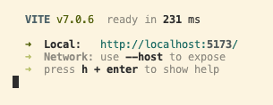
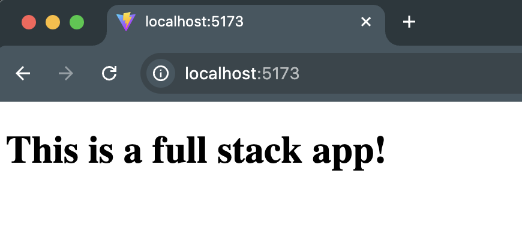

# Plantasy - Front-End Repo for Node/React Practicum

This is the front-end for our team's practicum project **Plantasy**.
It is a React app styled with Tailwind CSS that connects to a Node backend server.

It is suggested that you run these instructions **after** you setup the back-end server first.

You will have two folders inside one parent folder (one for front-end and one for back-end). Name the parent folder something appropriate (in the below example we title it **"Practicum Project"**). Then clone directly (do not fork and clone) the front and back repos while inside the parent (**"Practicum Project"**) project folder.


> The front-end app (React) will be running on port **5173**. The back-end server will be running on port **8000**. You will need to run locally both the front-end app and the back-end server at the same time to test your app.

**Features (MVP)**

- Auth - Sign up, Log in, Log out

- Observations - (authenticated users can upload photos, name, location, and notes)

- Plant Identification via Pl@ntNet API integration

- Browse and search recent posts from all users (Explore)

- Manage your personal plant observations (My Collection)

- Search Observations (filter by date, name, or location)


### Setting up local development environment

1. Clone this repository to the folder that was already created for both the front-end and back-end repos
2. Run `npm install` to install dependencies
3. Create `.env.local` file in your root directory with backend URL (see below)
4. Pull the latest version of the `main` branch (when needed)
5. Run `npm run dev` to start the development server
6. Open http://localhost:5173 with your browser to see the data received the back-end server.

Now you have your front-end and back-end running locally!

**Environment Variables**

Create `.env.local` in the project root:

```bash
# Backend base URL (required):
VITE_API_URL=http://localhost:8000/api/v1
```

A sample file is provided: `.env.local.example`

#### Running the front-end server in Visual Studio Code

Note: In the below example, the group's front-end repository was named `bb-practicum-team1-front` and the back-end repository was named `bb-practicum-team-1-back`. Your repository will have a different name, but the rest should look the same.



#### Running the front-end server in the browser



**Project Structure**

```bash
plantasy-frontend/
├── src/
│   ├── lib/              # API client & services
│   │   └── apiClient.js
│   ├── auth/             # AuthContext, LoginForm, SignupForm
│   ├── components/       # Shared UI: Button, Navbar; PlantCard, PlantGrid, EditPlantModal
│   ├── pages/            # Home, Explore, Login, Signup, PageNotFound, PlantDetail, PlantIdentifier, Plants
│   ├── routes/           # PrivateRoute
│   │   └── PrivateRoute.jsx
│   ├── styles/           # Tailwind + global styles
│   └── App.jsx / main.jsx
├── public/
├── .env.local.example
├── package.json
└── README.md
```

**Tech Stack**

- React (Vite)

- Figma

- Tailwind CSS

- React Router DOM

- Context API for auth

- Fetch API (custom apiClient)

- Node/Express backend (separate repo)

- Jira

### Git Workflow - Step by Step Guide

#### Creating a New Branch

1. Make sure you're on the main branch: `git checkout main`
2. Pull the latest changes: `git pull origin main`
3. Create and switch to a new branch: `git checkout -b your-feature-branch-name`
   - Use descriptive branch names like: `add-login-form`, `fix-header-styling`, `update-user-profile`

#### Making and Committing Changes

1. Make your code changes in your preferred editor
2. Check which files have been modified: `git status`
3. Stage your changes:
   - Stage specific files: `git add fileName.js`
   - Stage all changes: `git add .`
4. Commit your changes with a descriptive message:
   ```bash
   git commit -m "Add user authentication form with validation"
   ```

#### Pushing Changes and Creating Pull Requests

1. Push your branch to the remote repository:
   ```bash
   git push origin your-feature-branch-name
   ```
2. Go to the **GitHub** repository in your browser
3. Click **"Compare & pull request"** button that appears
4. Write a clear description of your changes
5. Request review from your team members
6. Wait for approval before merging
